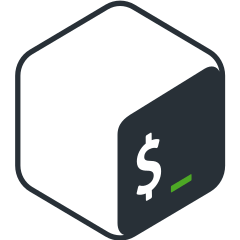

<h1 align="center">
  
</h1>

<h5 align="center">
  <code>
    <a href="https://www.linkedin.com/in/furkanaliunal/" title="LinkedIn Profile">LinkedIn </a></code>
  <code><a href="https://www.hackerrank.com/OnwexryS" title="HackerRank Profile">HackerRank </a></code>
  <code><a href="https://www.instagram.com/onwexrys/" title="Instagram Profile">Instagram</a></code>
</h5>
 

  Hi, I'm Furkan Ali Ünal, Computer Engineer & Software Developer from Turkey
   
   
  🔬 I'm a student in Fırat University Computer Engineering Department
   
  🎓 Going to graduate at 2022 June
   
  💻 I love coding and learning more about it 💖
   
  ☕ I love java
   
  📚 I study on Back-end Development and Spring Framework 🍀
   
  💬 You can ask me anything from <a href="https://github.com/furkanaliunal/furkanaliunal/issues" title="Issues">Here</a>
   
  📫 How to reach me: <a href="mailto: furkanaliuna4@gmail.com">furkanaliuna4@gmail.com</a>
   
   
   
  💖 I love Minecraft Plugin Development 💖 
   
  💎 I will add more repos and informations about me and my projects. I am getting more and more active here! 👏🏻

<h2 align="center">🔥 Languages & Frameworks & Tools & Abilities 🔥</h2>
 

  <code></code>
  <code></code>
  <code></code>
  <code></code>
  <code></code>
  <code></code>
  <code></code>
  <code></code>
  <code></code>
  <code></code>
  <code></code>
  <code></code>
  <code></code>
  <code></code>
  <code></code>
  <code></code>
  <code></code>
  <code></code>
  <code></code>
  <code></code>

<h2 align="center">⚡ Stats ⚡</h2>
 

  

    
    
  

           
  

    
  

   
  

<!--
<h2 align="center">👨‍💻 Repositories 👨‍💻</h2>
 

  

      

  
  

      

  
  

      

  
  

-->
      
<h4 align="center">
  <a href="https://github.com/furkanaliunal?tab=repositories" title="Show Repositories">🔎 Show All Repositories 🔍</a>
</h4>

  <!--
  **ramazansancar/ramazansancar** is a ✨ _special_ ✨ repository because its `README.md` (this file) appears on your GitHub profile.

  Here are some ideas to get you started:

  - 🔭 I’m currently working on ...
  - 🌱 I’m currently learning ...
  - 👯 I’m looking to collaborate on ...
  - 🤔 I’m looking for help with ...
  - 💬 Ask me about ...
  - 📫 How to reach me: ...
  - 😄 Pronouns: ...
  - ⚡ Fun fact: ...

  Notes: If you want use this readme, firstly star it please. If you can't align your repositories like this, please change your repository desription to shorter than now. Maybe 4 or 5 word will be good.

  

  -->